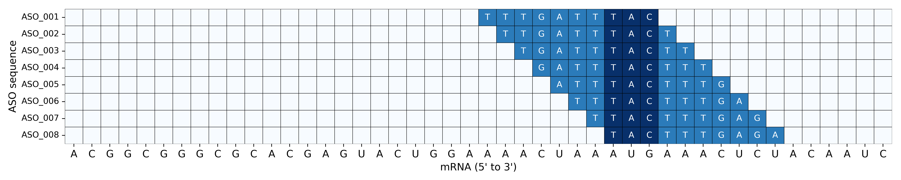
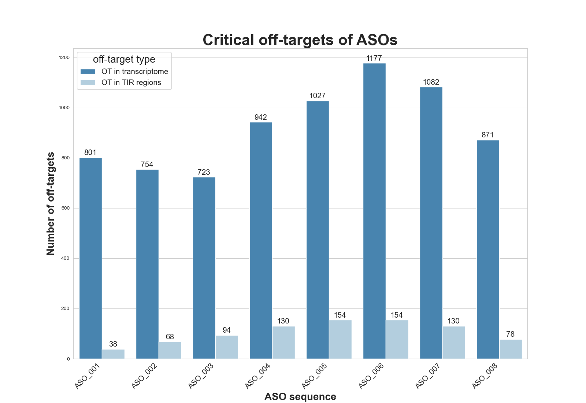
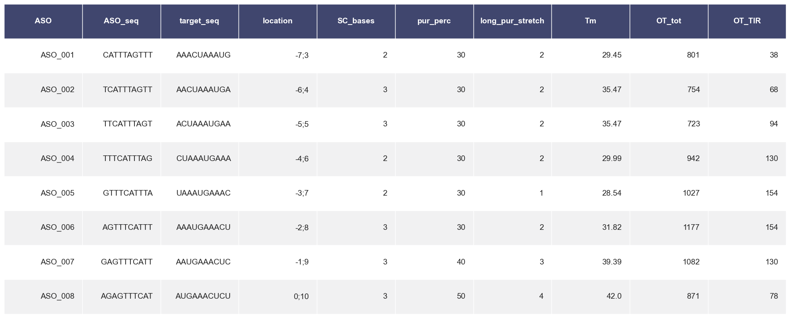

# MASON - command line version

Date: 13-04-2020

Author: Jakob Jung

Supervision: Lars Barquist

Software needed: Bash shell, [Anaconda](https://docs.anaconda.com/anaconda/install/linux/) / [Miniconda](https://docs.conda.io/projects/conda/en/latest/user-guide/install/linux.html), git


## Introduction

Here we present the command line version of MASON (Make **A**nti**S**ense **O**ligomers **N**ow). It is the bash-executable version of the MASON web-tool. It enables users to screen PNAs and other antisense oligomers (ASOs) for off-target effects and sequence attributes. Compared to the website (https://www.helmholtz-hiri.de/en/datasets/mason/), it can be used to screen pre-defined sets of ASOs for off-targets in targeted organisms. 


## Installation

To install the command line version of MASON, you need a linux-based bash shell and an installed version of [Anaconda](https://docs.anaconda.com/anaconda/install/linux/) or [Miniconda](https://docs.conda.io/projects/conda/en/latest/user-guide/install/linux.html) and [git](https://git-scm.com/book/en/v2/Getting-Started-Installing-Git). Start by cloning the git repository by:

```bash
git clone git@github.com:BarquistLab/mason_commandline.git
```

 Now, you can enter the directory and install all required packages with conda. For this we can use the mason_environment.yaml file in which packages are stored. This can take some minutes:

```bash
cd mason_commandline
conda env create -n mason_environment --file mason_environment.yml
```

That's it. Now you're ready to go to run mason from the command line.


## User manual

Now that you have installed MASON on the command line, there are two ways of using it. If you have a gene which you want to target and no Sequences yet, you can use option 1. If however you already have designed ASOs and just want to test their sequence attributes and off-targets, use option 2. 

To print the help page, specifying all required user inputs, write:

```bash
sh mason.sh -h
```


#### 1. ASO Design + Sequence attributes + off-target screen

If you have a target gene or more genes for which you want to design ASOs, use this option. Required parameters are:

- -f	fasta file of target organism

- -g	GFF file of target organism

- -m	nr. of mismatches allowed for off-target screening

- -i	ID of the result (results folder will be called like this)

- -t	target gene; use the locus tag(s), as annotated in the GFF, column 9, e.g. [...] ;locus_tag=**b1253**; [...]

- -l	Length of ASO to be designed. usually 9-12 recommended

- -b (optional)	bases before the start codon, forwhich ASOs should be designed.

For example you can use this code, when your data are called ecoli536.fasta and ecoli536_sRNAs.gff3 to generate 10mer ASOs and screen for off-targets with up to 2 mismatches:

```bash
sh mason.sh -f ./data/example_data_mason_cmdline/ecoli536.fasta -g ./data/example_data_mason_cmdline/ecoli536_sRNAs.gff3 -m 2 -i result_1 -t ECP_0004 -l 10
```

 Outputs are, same as in the web tool:









#### 2. Sequence attributes + off-target selection

If you already have designed your sequences and want to screen it for off-targets, melting temperature, etc. use this option. Required parameters are:

- -f	fasta file of target organism

- -g	GFF file of target organism

- -m	nr. of mismatches allowed for off-target screening

- -i	ID of the result (results folder will be called like this)

For example you can use this code, when your data are called sequence.fasta and sequence_annot.gff3 to screen for off-targets and other attributes with up to 2 mismatches in your custom ASO sequences, stored in a fasta file "ASO_seqs.fasta":

```bash
sh mason.sh -f ./data/example_data_mason_cmdline/ecoli536.fasta -g ./data/example_data_mason_cmdline/ecoli536_sRNAs.gff3 -m 2 -i result_2 -p ./data/example_data_mason_cmdline/pnas_upec.fasta
```

Outputs are similar, just for different sequences.
