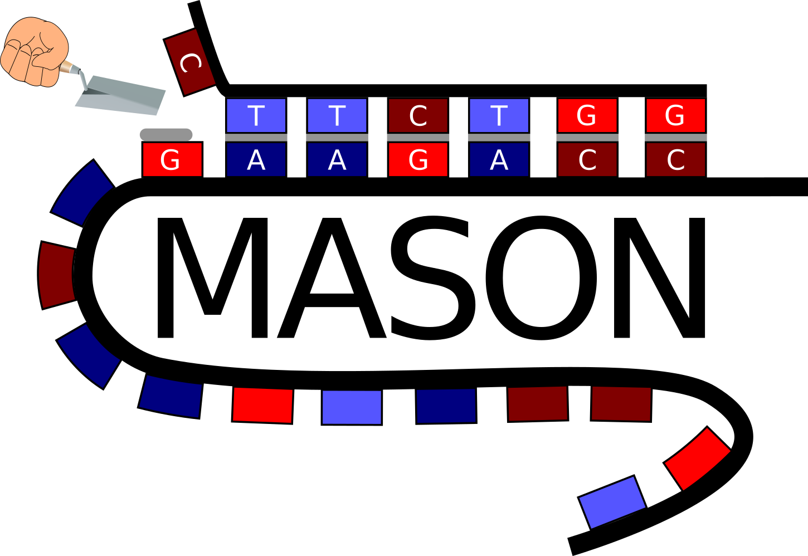

# MASON - command line version

Date: 13-04-2020

Author: Jakob Jung

Supervision: Lars Barquist

Software needed: Bash shell, [Anaconda](https://docs.anaconda.com/anaconda/install/linux/) / [Miniconda](https://docs.conda.io/projects/conda/en/latest/user-guide/install/linux.html)



## Introduction

We present the command line version of MASON (Make **A**nti**S**ense **O**ligomers **N**ow). It is the bash-executable version of the MASON web-tool. It enables users to screen PNAs and other antisense oligomers (ASOs) for off-target effects and sequence attributes. Compared to the website (https://www.helmholtz-hiri.de/en/datasets/mason/), it can be used to screen pre-defined sets of ASOs for off-targets in targeted organisms. 

## Installation

To install the command line version of MASON, you need a linux-based bash shell and an installed version of [Anaconda](https://docs.anaconda.com/anaconda/install/linux/) or [Miniconda](https://docs.conda.io/projects/conda/en/latest/user-guide/install/linux.html). Start by cloning the git repository by:

```bash
git clone git@github.com:jakobjung/mason_commandline.git
```

 